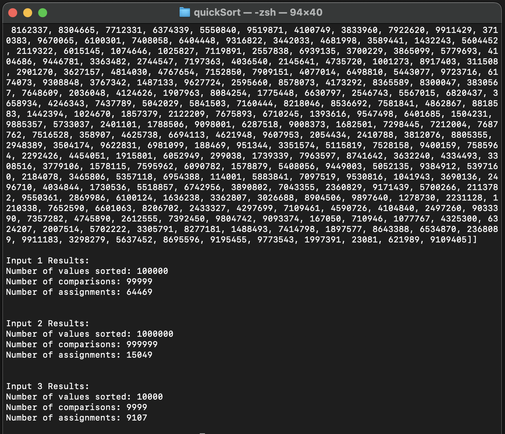

 # Implementing Quicksort
 # Khalid Kofiro

This project implements quicksort on a folder of files containing hundreds of thousands of numbers, and
prints out the results clearly. 

# Classes

 * quicksort.py - The file containing the quicksort and partition functions.
 numreadwrite.py - The file containing the read and write functions.

 * filesToSort the file containing the files to be sorted
 input.txt , input2.txt, input3.txt - One of the files containing the set of numbers that are read into the array.

 * input_sorted1.txt, input_sorted2.txt, input_sorted3.txt - The files containing the set of numbers that are sorted and written from the input.txt file.

 * quicksort_main.py - The main file that reads and applies quicksort to the input.txt file. Then writes the sorted array into the input_sorted.txt file.

 # How to use it!

 * Once opened in your IDE, modify the numbers in the input.txt file however you would like.

 * Then, in your terminal make sure you are in the right repository.

 * Once you do that, run python3 quicksort_main.py input.txt

 * You should see the numbers you have input into the text file sorted in terminal. Along with them sorted in the new input_sorted.txt file.

  

 # Counters
 * Implemented counters that gather statistics about input size, comparisons and assignments.
 Results are printed when ran

 * Provided a results file for 3 tests as an example.

Enjoy!

